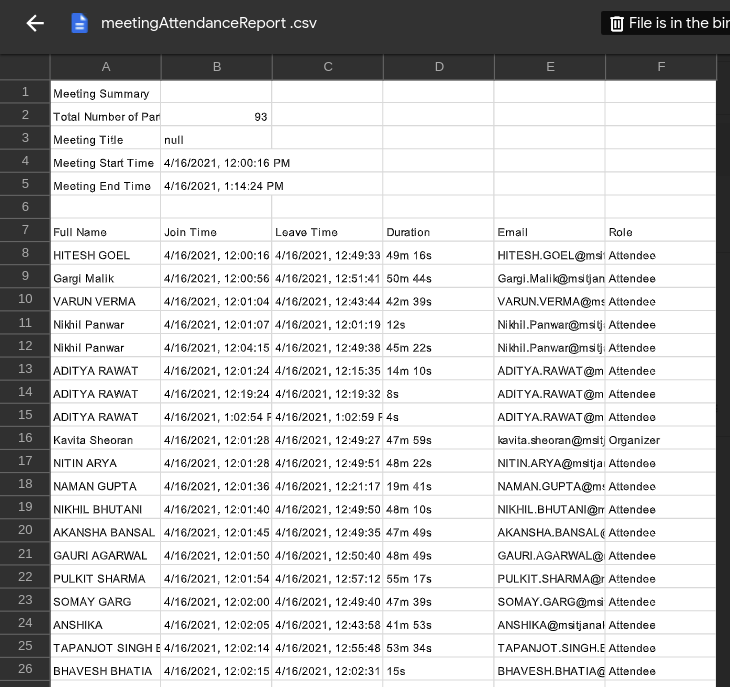
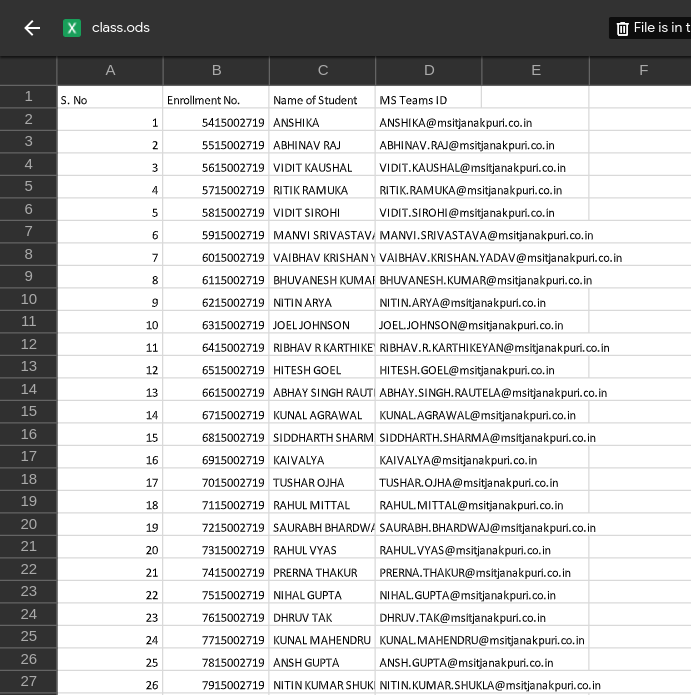

# RikRak-attendance

Please feel free to download the packaged desktop application [here](https://drive.google.com/drive/folders/187j1OYoeUpJV5F7NVcqwqySMawy4-yLE?usp=sharing).

## So why an attendance app?
So the idea is simple. We have our online classes on Microsoft teams and professors get an option to download all the attendees attendance report which looks like this:

But the issue was that they have to manually mark present absent in their record sheets for each student which was quite a time consuming task

So this is how a simple desktop app where we have to select the downloaded attendance report and the record sheet of students, and on just one click there attendance is marked.

Note: attendance is marked for those students who are in the meeting for more than 45 min.

## Completed and Working features
*Please raise an issue instantly if you find something wrong with these features*
For using this applications these are some things you have to keep in mind:
- attendance report from the teams should be downloaded after the class:
	- As it gives a uniquie key i.e. microsoft teams id.
	- And rules outs the marking of false attendance for students having same name.
- students records should be an excel file where it should have column name "MS Teams ID" with teams id of every student like this:

## Planned Features
- Getting cummulative attendance of each student after each month.
- Package the application for mac os and linux distros.

## Structure of the application
So lets talk about this application. This is an electron.js desktop application, where it's made using HTML, CSS, js and Nodejs.

## Contributions
If there's a feature you'd want in this app or if there's something you might not like, and would want changed, feel free to raise an issue or comment on a previous one. Questions, Suggestions, Ideas, Complaints or even if it is some random banter, you'd like to discuss. Reach me out. 😄
